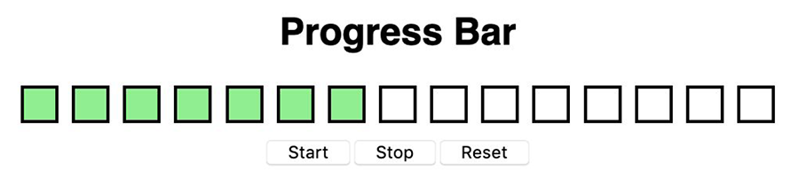

# Progress Bar &middot; [](https://www.npmjs.com/package/npm) [](https://github.com/your/your-project/blob/master/LICENSE)

> Descripcion del Challenge

El ejercicio consiste en elaborar una progress bar de 15 casilleros, los cuales deberán inicialmente aparecer como desactivados (en blanco). Cuando se active la progress bar, la misma debería ir llenando los casilleros con un color de fondo, con un intervalo de 0.5 segundos entre cada casillero. Además, deberán existir tres botones, uno de ‘Start’ para dar inicio al funcionamiento de la barra, otro de ‘Stop’, que permite detener el curso de ejecución de la barra en cualquier momento, y uno de ‘Reset’, para volver la barra a su estado inicial. Es importante que el estado persista al momento de clickear cualquiera de estos botones. Por ejemplo, si hago click en el botón start y luego aprieto stop estando en el segundo casillero, cuando vuelva a tocar start la barra debe reanudar desde el casillero donde se detuvo (no desde 0). La única manera de volver a 0 la barra es mediante el botón Reset.


## Instalacion

Instalar los paquetes necesarios y correr la app en modo desarrollo. Abrir [http://localhost:3000](http://localhost:3000) para verlo en el navegador.

```shell
npm install
npm start
```

### Contruido Con

Creado con create-react-app con React v17.0.2.

### Prerequisitos

Se necesita tener instalado en tu maquina NodeJS y npm.
